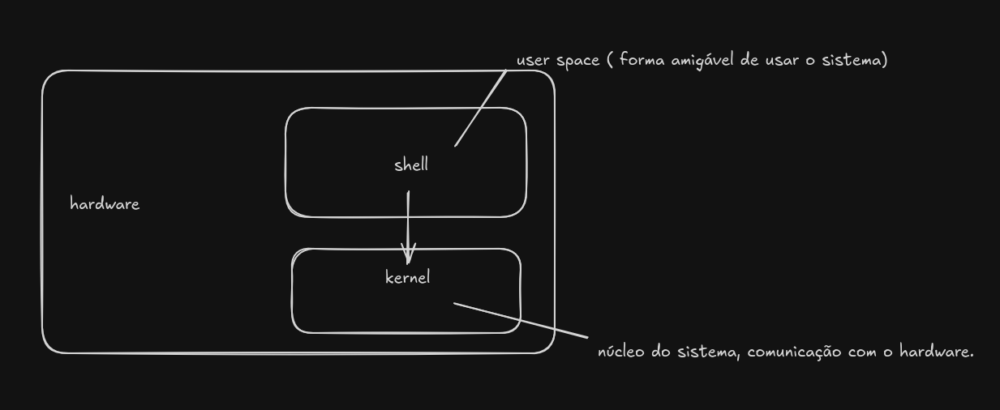
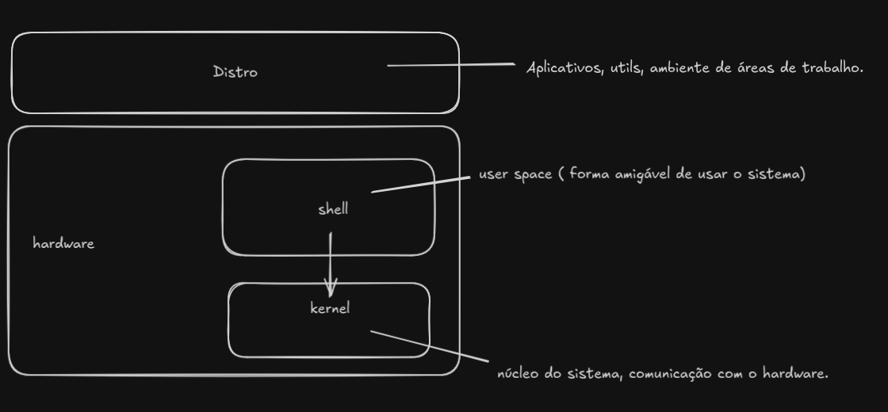

# Linux and Distros

O Linux é um sistema operacional de código aberto, baseado no núcleo (kernel) criado por Linus Torvalds em 1991. Ele foi inspirado no Unix e é conhecido por sua estabilidade, segurança e flexibilidade.

Ao contrário de sistemas proprietários como Windows ou macOS, o Linux pode ser livremente modificado e distribuído, o que resultou na criação de inúmeras distribuições (ou “distros”), como Ubuntu, Debian, Fedora, Arch Linux e Red Hat, cada uma com foco e público diferentes.

essa seta representa a interação do usuario com o shell, provocando alterações no kernel do sistema.

## Distribuições / DISTROS

São implementações do kernel linux, tipo sabores. Você escolhe oq mais lhe agrada com diversos estilos e focos específicos tipo, desktops ou até mesmo servidores. 

## Tipos de DISTROS

### Enterprises(Servidores)

São versões mais estáveis dos sistemas e bastante testadas por serem de sistemas de servidores.

    - **RedHat**: Disponibiliza seu sistema para todos poderem usar, mas eles também vendem seus serviços de suporte para grandes empresas.
    - CentOS
    - OpenSuse
    - UbuntuServer: sim, além da versão desktop, existe uma versão server.

### Dekstop

São as distribuições mais usadas e seus (gerenciadores de pacotes), mais á frente explico isso para vocês.

    (APT)
    - Debian, o pai de todos.
    - Ubuntu, baseado no debian.
    - Linux Mint, baseado no Ubuntu que é baseado no debian.

    (RPM)
    - Fedora, esse é um pouco diferente é um projeto mantido pela Red Hat e é diponibilizado para o público.

    (Pacman)
    - Arch: É o sistema mais leve de todos, porém é o mais complicado por sua filosofia de DIY(Do it yourself), ou seja, TUDO é por sua conta para configurar. Hoje em dia é mais amigável de configurar por conta de scripts criados pela comunidade bastante prestativa.

    - Manjaro: Esse é baseado no Arch, porém tiveram pena dos novatos.